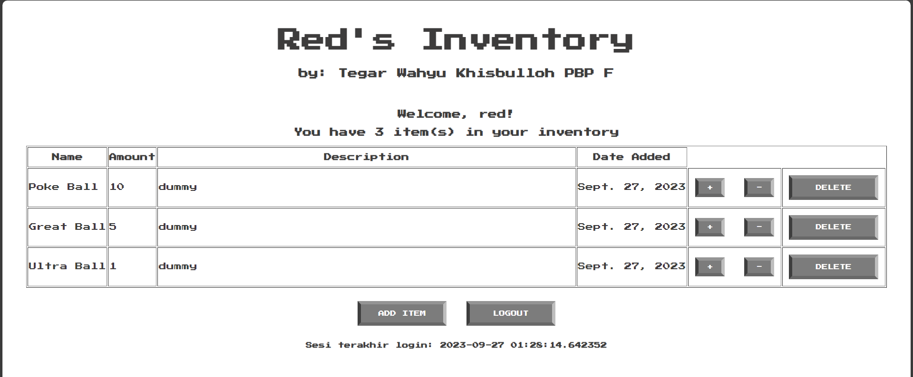
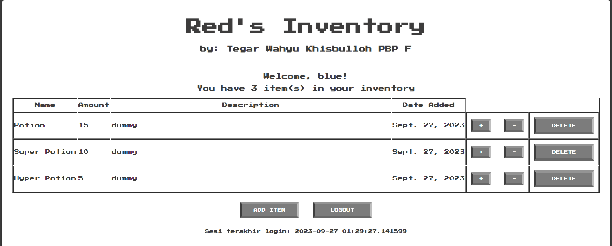

https://red-s-inventory.adaptable.app/

Nama    : Tegar Wahyu Khisbulloh <br>
NPM     : 2206082032 <br>
Kelas   : PBP F <br>

# TUGAS 2

## Jelaskan bagaimana cara kamu mengimplementasikan checklist di atas secara step-by-step (bukan hanya sekadar mengikuti tutorial).

### Membuat Proyek Django baro
- Langkah pertama sebelum membuat Proyek Django adalah menginstall Django. Hal ini dapat dilakukan dengan atau tanpa virtual environment. Saya menginstall dengan virtual environment, caranya adalah sebagai berikut:
a. Membuat direktori proyek misal `red-s-inventory`
b. Buat virtual environment dengan command `python -m venv env`
c. Jalankan virtual environment dengan command `env\Scripts\activate.bat`

- Untuk keperluan app ini, saya menggunakan dependencies yang akan diinstall bersamaan dengan Django yang disimpan dalam file `requirements.txt` yang berisi :
   ```text
    django
    gunicorn
    whitenoise
    psycopg2-binary
    requests
    urllib3
    ```
- Kemudian saya menjalankan command `pip install -r requirements.txt` untuk menginstall django dengan beberapa dependencies

- Buat proyek baru dengan menjalankan command 
   ```bash
    django-admin startproject red-s-inventory'
   ```

- Saya menambahkan `*` di `settings.py` di bagian `ALLOWED_HOSTS` untuk keperluan deployment

### Membuat aplikasi dengan nama `main` pada proyek
- Untuk membuat sebuah app `main`, saya menjalankan command 
```bash
python manage.py startapp main
``` 

- Setelah app dibuat, saya mendaftarkan app `main`` ke dalam `settings.py`
```python
  INSTALLED_APPS = [
    ...,
    'main',
    ...
  ]
  ```

### Melakukan Routing pada Proyek agar dapat menjalankan `main`
Untuk melakukan Routing, saya perlu menambahkan pola url ke dalam `urlpatterns` yang ada di dalam file `urls.py` dalam
```python
  from django.contrib import admin
  from django.urls import path, include
  
  urlpatterns = [
      path('admin/', admin.site.urls),
      path('main/', include('main.urls')),  # menambahkan baris ini
  ]
  ```
Tujuan penambahan ini adalah untuk menetapkan rute dasar untuk app `main`

### Membuat Model Item
- Pada tahap ini, saya menyesuaikan `models.py` untuk keperluan app saya yaitu:
```python
    from django.db import models

    class Item(models.Model):
        name = models.CharField(max_length=255)
        amount = models.IntegerField()
        description = models.TextField()
  ```

- Setelah itu, saya melakukan membuat berkas migrasi dan mengaplikasikannya ke basis data dengan command:
```bash
  python manage.py makemigrations
  ```
dan 
``` bash
  python manage.py migrate
  ```

### Membuat fungsi pada views.py
Pada tahap ini, saya dapat menentukan seperti apa tampilan app saya nanti.
- Pertama tama, saya perlu membuat direktori `templates` dalam direktori `main` untuk menyimpan file html
- Kemudian, saya perlu membuat file `main.html` dan mengisinya sesuai ketentuan soal dan menambahkan beberapa hal sesuai preferensi saya

### Membuat routing pada `urls.py` pada `aplikasi main`
Tahap ini dilakukan pada file `urls.py` yang berada di direktori `main`
from django.urls import path
```python
from main.views import homepage

app_name = 'main'

urlpatterns = [
    path('', homepage, name='homepage'),
]
```

### Deployment 
- Dalam tahap ini saya perlu Sign In ke dalam website adaptable dan menghubungkan repository yang telah saya buat. Kemudian menyesuaikan beberapa hal yang diminta oleh Adaptable seperti `deployment branch, template deployment, tipe basis data, dan start command`.
- Kemudian saya melakukan deployment dengan menekan `Deploy App`


### Membuat README.md 
- Dalam pembuatan versi terbaru aplikasi saya ini, terdapat kendala deployment yaitu pemblokiran akun oleh Adaptable sehingga tidak bisa menambahkan link untuk menuju ke dalam aplikasi saya.


## Buatlah bagan yang berisi request client ke web aplikasi berbasis Django beserta responnya dan jelaskan pada bagan tersebut kaitan antara `urls.py`, `views.py`, `models.py`, dan berkas `html`.


- `urls.py` adalah tempat untuk mendefinisikan rute rute aplikasi pada proyek Django. Ada 2 `urls.py` :
1. `urls.py` pada proyek Django, berfungsi sebagai penghubung rute dasar dengan rute yang didefinisikan pada `urls.py` pada direktori app
2. `urls.py` pada direktori app, berfungsi menghubungkan rute tertentu setiap aplikasi dengan fungsi `views` yang sesuai.

- `views.py` berisi beberapa fungsi untuk mememnuhi permintaan Client dengan mengakses `models.py` dan menampilkan `template html` sesauai request

- `models.py` adalah struktur atau kerangkan data aplikasi. `models.py` digunakan oleh `views.py` untuk menyimpan, mengambil, atau memodifikasi data dalam database.

- `template html` berisi template tampilan yang akan digunakan sebagai response yang dikirimkan ke Client. Response akan berupa template yang sudah disesuaikan dengan data yang diperoleh pada request dan sesuai dengan kerangka data pada `models.py`

## Jelaskan mengapa kita menggunakan virtual environment? Apakah kita tetap dapat membuat aplikasi web berbasis Django tanpa menggunakan virtual environment?

Ada beberapa alasan mengapa kita menggunakan virtual environment:

1. Isolasi Proyek: Virtual environment memungkinkan kita untuk membuat lingkungan yang terisolasi untuk setiap proyek Python yang kita kerjakan. Ini berarti semua dependensi (library dan package Python) yang diperlukan untuk proyek tersebut dapat diinstal secara independen di lingkungan tersebut. Dengan cara ini, proyek-proyek yang berbeda tidak akan saling mengganggu atau memiliki konflik dalam hal dependensi.

2. Versi Python yang Berbeda: kita dapat menggunakan versi Python yang berbeda untuk setiap lingkungna virtual. Ini berguna jika kita bekerja pada proyek-proyek yang memerlukan versi Python yang berbeda.

3. Mudah Dikelola: Virtual environment memudahkan pengelolaan dependensi proyek kita. kita dapat membuat daftar dependensi yang diperlukan dalam file khusus seperti requirements.txt, yang dapat dengan mudah diinstal atau diperbarui dalam lingkungan virtual tertentu.

4. Menghindari Konflik: Tanpa virtual environment, jika kita menginstal package atau library global, ini dapat mengakibatkan konflik dengan paket lain yang memerlukannya. Ini dapat merusak stabilitas sistem kita.

5. Keamanan: Virtual environment membantu mencegah proyek kita mengubah atau merusak instalasi Python global yang mungkin diperlukan oleh sistem operasi atau aplikasi lain.

Ya, kita dapat membuat aplikasi web berbasis Django tanpa menggunakan virtual environment. Namun, tidak disarankan karena akan menyulitkan pengelolaan proyek kita dan dapat menyebabkan masalah dependensi. Menggunakan virtual environment adalah praktik terbaik dalam pengembangan Python, dan itu akan membuat pengelolaan proyek kita lebih mudah, lebih aman, dan lebih terorganisir.

## Jelaskan apakah itu MVC, MVT, MVVM dan perbedaan dari ketiganya.

1. MVC (Model-View-Controller):
Model: Merepresentasikan data dan logic dalam aplikasi.
View: Menangani tampilan dan presentasi data.
Controller: Mengendalikan alur aplikasi dan berfungsi sebagai perantara antara Model dan View.

2. MVT (Model-View-Template):
Model: Merepresenasikan data dan logic.
View: Menangani tampilan dan presentasi data.
Template: Menentukan cara data disajikan dalam HTML. Template menggantikan peran Controller dalam MVC.

3. MVVM (Model-View-ViewModel):
Model: Merepresentasikan data dan logic.
View: Menangani tampilan dan presentasi data.
ViewModel: Berfungsi sebagai perantara antara Model dan View. Ini mengelola data yang diperlukan oleh View dan berfungsi untuk memisahkan logika tampilan dari Model.

Perbedaannya:
- MVC adalah pola desain yang digunakan terutama dalam pengembangan software desktop dan web tradisional. Memiliki Controller yang mengendalikan alur aplikasi.
- MVT mirip dengan MVC, tetapi dalam konteks Django, Template (yang menggantikan Controller) digunakan untuk menentukan cara data disajikan dalam HTML.
- MVVM adalah pola desain yang digunakan dalam aplikasi berbasis interface pengguna yang lebih kompleks, terutama dalam pengembangan aplikasi seluler dan aplikasi dengan tampilan dinamis. Menggunakan ViewModel untuk mengelola data yang ditampilkan di View, memungkinkan tampilan untuk berubah otomatis sesuai dengan perubahan data pada Model, sehingga membuat aplikasi lebih reaktif dan mudah diuji.

## Bonus
- Saya menambahkan beberapa tes dalam `test.py` untuk Model dan response:
```python
    # test_pokeball_item: memastikan bahwa item pokeball ada
    def test_pokeball_item(self):
        pokeBall = Item.objects.create(name='Pokeball', amount=10, description='Pokeball is a ball')
        field_label = pokeBall._meta.get_field('name').verbose_name
        self.assertEqual(field_label, 'name')

    # test_medicine_item: memastikan bahwa item medicine ada
    def test_medicine_item(self):
        pokeBall = Item.objects.create(name='Potion', amount=10, description='Potion is a medicine')
        field_label = pokeBall._meta.get_field('name').verbose_name
        self.assertEqual(field_label, 'name')
```
- Untuk menjalankan tes tersebut bisa dilakukan dengan command `python manage.py test`


-----
# TUGAS 3

##  1. Apa perbedaan antara form `POST` dan form `GET` dalam Django?
<table>
  <tr>
    <th>POST</th>
    <th>GET</th>
  </tr>
  <tr>
    <td>Data/value tidak terlihat di URL</td>
    <td>Data/value terlihat di URL</td>
  </tr>
  <tr>
    <td>Paramater tidak tersimpan di web browser history</td>
    <td>Paramater tersimpan di web browser history</td>
  </tr>
  <tr>
  <td>Digunakan untuk meng-handle request yang bisa digunakan untuk mengubah keadaan sistem</td>
  <td>Digunakan untuk meng-handle request yang tidak mengubah keadaan sistem</td>
  </tr>
</table>

## 2. Apa perbedaan utama antara `XML`, `JSON`, dan `HTML` dalam konteks pengiriman data?
<table style="width:100%">
  <tr>
    <th>XML</th>
    <td>
    - Digunakan secara luas dalam berbagai aplikasi, termasuk pertukaran data antar sistem, konfigurasi, dan penyimpanan data yang sangat struktural.
    <br>
    - Lebih kompleks daripada JSON dan HTML karena memungkinkan definisi aturan dan struktur yang lebih kustom.</td>
  </tr>
  <tr>
    <th>JSON</th>
    <td>
    - Mendukung struktur data yang lebih sederhana daripada XML dan biasanya digunakan untuk pertukaran data di aplikasi web dan layanan web (API).
    <br>
    - Format penukaran data ringan yang mudah dibaca oleh manusia dan mudah diurai mesin.
    </td>
  </tr>
  <tr>
    <th>HTML</th>
    <td>
    - Tidak dirancang untuk pertukaran data seperti XML dan JSON.
    <br>
    - Digunakan untuk mengatur tampilan dan struktur halaman web, termasuk teks, gambar, tautan, formulir, dan elemen-elemen lainnya.
    </td>
  </tr>
</table>

## 3. Mengapa `JSON` sering digunakan dalam pertukaran data antara aplikasi web modern?
Karena JSON memiliki beberapa keunggulan yang membuatnya cocok untuk digunakan dalam pertukaran data antar aplikasi web. 
<br> 
Keunggulan tersebut antara lain:
1. JSON memiliki syntax yang sederhana dan mudah dibaca. 
2. JSON adalah format data yang ringan dan memiliki overhead yang minim. Ini berarti data JSON dapat dikirim dan diterima dengan cepat melalui jaringan, mengurangi latensi.
3. JSON sering digunakan dalam API berbasis REST (Representational State Transfer) yang banyak digunakan dalam pengembangan web modern. API REST menggunakan JSON untuk mengirim dan menerima data, memungkinkan aplikasi berkomunikasi dengan mudah.

## 4. Jelaskan bagaimana cara kamu mengimplementasikan checklist di atas secara step-by-step (bukan hanya sekadar mengikuti tutorial).

###  Membuat input `form` untuk menambahkan objek model pada app sebelumnya.
1. Membuat file `forms.py` dan menambahkan kode sebagai berikut:
```python
from django.forms import ModelForm
from main.models import Item

class ItemForm(ModelForm):
    class Meta:
        model = Item
        fields = ["name", "amount", "description"]
```
2. Menambahkan import yang dibutuhkan ke dalam `views.py`
```python
from django.http import HttpResponseRedirect # import untuk redirect ke halaman lain
from main.forms import ItemForm # Import ItemForm yang ada di dalam `forms.py`
from django.urls import reverse # # Import untuk kembali ke halaman utama
```

3. Menambahkan method baru dalam `views.py` untuk menghandle request menambahkan item
```python
def add_item(request):
    form = ItemForm(request.POST or None) # Membuat form baru
    
    if form.is_valid() and request.method == "POST": # Jika form valid dan method POST
        form.save() # Simpan form
        return HttpResponseRedirect(reverse('main:homepage')) # Redirect ke homepage

    context = {'form': form} # Buat context
    return render(request, "add_item.html", context) # Render add_item.html dengan context yang sudah dibuat
```

4. Meng-update method homepage dalam `views.py` untuk 
```python
def homepage(request):
    items = Item.objects.all() # Query semua item dari database
    context = {
        'name' : 'Tegar Wahyu Khisbulloh',
        'class' : 'PBP F',
        'items': items 
        }
    return render(request, "main.html", context)
```

5. Import method `add_item` tadi ke `urls.py`
```python
from main.views import homepage, add_item
```
Tambahkan path url `add_item` ke `urlpatterns`
```python
urlpatterns = [
..
path('add_item', add_item, name='add_item'),
...
]
```
6. Membuat file HTML `add_item.html` dalam direktori `main/templates` untuk menampilkan interface add_item
```HTML
 


<title>Add Item</title>
<head>
    <div class = "title">
        <h1>Add Item</h1>
    </div>

<form method="POST">
    
    <div class="form-container">
        <div class="input">
            {{ form.as_table }}
        </div>
        <button class="button">
            Add Item
        </button>
    </div>
</form>

</head>
<style>
    .input {
        margin: auto;
        box-sizing: border-box;
    }
    
    .input label {
        padding: 12px 12px 12px 0;
        display: inline-block;
    }
    
    .input input[type=text], input[type=number], textarea {
        width: 100%;
        padding: 12px;
        border: 1px solid #ccc;
        box-sizing: border-box;
        margin-top: 6px;
        margin-bottom: 16px;
        resize: vertical;
        background-color: #9f9f9f;
    }
    
    .form-container {
        max-width: 300px;
        width: 100%;
        padding: 20px;
        background-color: white;
        margin: auto;
        border: 10px solid #3d3c3c;
    }
</style>

```

7. Menyesuaikan tampilan `main.html`
```HTML
<body>
    <!-- Jika tidak ada item, sembunyikan tabel -->
    
    <table align="center" border="1px" style="width:1400px; line-height:30px;">
        <tr>
            <th>Name</th>
            <th>Amount</th>
            <th>Description</th>
            <th>Date Added</th>
        </tr>

         Berikut cara memperlihatkan data produk di bawah baris ini 

        
        <tr>
            <td>{{ item.name }}</td>
            <td>{{ item.amount }}</td>
            <td>{{ item.description }}</td>
            <td>{{ item.date_added }}</td>
        </tr>
        
    </table>
    
    <br />

    <div align="center">
        <a href="">
            <button class="button">
                Add Item
            </button>
        </a>

        <!-- Jika tidak ada item, sembunyikan button clear items -->
        
        <a href="">
            <button class="button">
                Clear Item
            </button>
        </a>
        

    </div>
</body>
```

###  Tambahkan 5 fungsi `views` untuk melihat objek yang sudah ditambahkan dalam format HTML, XML, JSON, XML *by ID*, dan JSON *by ID*.
1. Menambahkan beberapa import yang dibutuhkan terlebih dahulu
```python
from django.http import HttpResponse # import HttpResponse untuk menampilkan response
from django.core import serializers # import serializers untuk mengubah data menjadi json atau xml
```
2. Menambahkan fungsi `show_xml`, `show_json`, `show_xml_by_id`, `show_json_by_id`. (Fungsi untuk menampilkan data dalam format html sudah dibuat yaitu fungsi `homepage`)
```python
def show_xml(request):
    # Mengambil semua data dari database
    data = Item.objects.all() 
    # Mengembalikan response berupa XML
    return HttpResponse(serializers.serialize("xml", data), content_type="application/xml") 
def show_json(request):
    # Mengambil semua data dari database
    data = Item.objects.all()
    # Mengembalikan response berupa JSON
    return HttpResponse(serializers.serialize("json", data), content_type="application/json")

def show_xml_by_id(request, id):
    # Mengambil semua data dari database berdasarkan ID
    data = Item.objects.filter(pk=id)
    # Mengembalikan response berupa XML
    return HttpResponse(serializers.serialize("xml", data), content_type="application/xml")

def show_json_by_id(request, id):
  # Mengambil semua data dari database berdasarkan ID
    data = Item.objects.filter(pk=id)
    # Mengembalikan response berupa JSON
    return HttpResponse(serializers.serialize("json", data), content_type="application/json")
```
###  Membuat routing URL untuk masing-masing `views` yang telah ditambahkan pada poin 2.

1. Import 5 fungsi yang telah dibuat ke `urls.py` 
```python
from main.views import homepage, add_item, clear_items, show_xml, show_json, show_xml_by_id, show_json_by_id 
```
2. Menambahkan pattern url untuk masing-masing fungsi dalam variabel `urlpatterns`
```python
urlpatterns = [
    ...
    path('', homepage, name='homepage'), # HTML
    path('xml/', show_xml, name='show_xml'), # XML
    path('json/', show_json, name='show_json'), # JSON
    path('xml/<int:id>/', show_xml_by_id, name='show_xml_by_id'), # XML by ID
    path('json/<int:id>/', show_json_by_id, name='show_json_by_id'), # JSON by ID
    ...
]
```

## Mengakses kelima URL di poin 2 menggunakan Postman, membuat screenshot dari hasil akses URL pada Postman, dan menambahkannya ke dalam `README.md`.
1. HTML

2. XML

3. JSON

4. XML by ID

5. JSON by ID


## BONUS: Menambahkan pesan "Kamu menyimpan X item pada aplikasi ini"
Menambahkan baris kode berikut ke dalam `main.html`
```HTML
<h3 align="center">You have {{ items|length }} item(s) in your inventory</h3>
```

# TUGAS 4

## Apa itu Django `UserCreationForm`, dan jelaskan apa kelebihan dan kekurangannya?

`UserCreationForm` adalah sebuah form bawaan Django yang digunakan untuk membuat form registrasi pengguna. Form ini sudah menyediakan field untuk input username, password, dan konfirmasi password. 

Kelebihan menggunakan `UserCreationForm` adalah kita tidak perlu membuat form registrasi dari awal, sehingga dapat menghemat waktu dan usaha dalam pengembangan aplikasi web. Selain itu, `UserCreationForm` juga sudah menyediakan validasi untuk memastikan bahwa input yang dimasukkan oleh pengguna valid.

Namun, kekurangan dari `UserCreationForm` adalah kurangnya fleksibilitas dalam hal tampilan dan validasi. Jika kita ingin menambahkan field tambahan atau validasi kustom, kita perlu membuat form registrasi dari awal atau membuat subclass dari `UserCreationForm`.

##  Apa perbedaan antara autentikasi dan otorisasi dalam konteks Django, dan mengapa keduanya penting?
<table>
    <tr>
        <th>
            Autentikasi (Authentication)
        </th>
        <th>
            Otorisasi (Authorization)
        </th>
    </tr>
    <tr>
        <td>
            Memeriksa apakah seorang pengguna adalah pengguna yang sah. Ini melibatkan proses verifikasi pengguna, seperti nama pengguna dan kata sandi. 
        </td>
        <td>
            Mengontrol akses pengguna terhadap sumber daya dan fitur tertentu dalam aplikasi web. Menentukan apakah pengguna memiliki hak akses untuk melakukan tindakan tertentu.
        </td>
    </tr>
        <td>
            Django memiliki sistem autentikasi yang kuat yang mendukung berbagai metode autentikasi, termasuk otentikasi berbasis sesi, otentikasi berbasis token, otentikasi OAuth, dan lainnya.
       </td>
       <td>
            Django menyediakan sistem otorisasi yang berbasis perizinan, yang memungkinkan User menentukan aturan akses berdasarkan peran dan izin pengguna.
       </td>
</table>

Keduanya penting karena membantu melindungi aplikasi dari akses yang tidak sah dan menentukan apa yang dapat dilakukan oleh pengguna yang sudah terotentikasi. Dengan autentikasi yang kuat, dapat dipastikan bahwa hanya pengguna yang sah yang dapat mengakses aplikasi, sementara dengan otorisasi, kita dapat mengendalikan tingkat akses dan hak pengguna dalam aplikasi untuk menjaga keamanan dan privasi data.

## Apa itu *cookies* dalam konteks aplikasi web, dan bagaimana Django menggunakan cookies untuk mengelola data sesi pengguna?
*Cookies* adalah file teks kecil yang disimpan pada komputer pengguna oleh server web. *Cookies* digunakan untuk menyimpan informasi tentang pengguna dan interaksi mereka dengan situs web, seperti preferensi pengguna, riwayat pencarian, dan data sesi.

Dalam konteks aplikasi web, cookies digunakan untuk mengelola data sesi pengguna. Data sesi adalah informasi yang disimpan pada server web tentang pengguna selama mereka menggunakan situs web. Data sesi dapat digunakan untuk menyimpan informasi seperti login pengguna, keranjang belanja, dan preferensi pengguna.

Django menyediakan modul `django.contrib.sessions` untuk mengelola data sesi pengguna. Modul ini menyediakan backend penyimpanan sesi yang berbeda, seperti database, cache, dan file. Django juga menyediakan middleware `django.contrib.sessions.middleware.SessionMiddleware` yang digunakan untuk menangani cookies dan mengelola data sesi pengguna.

## Apakah penggunaan *cookies* aman secara default dalam pengembangan web, atau apakah ada risiko potensial yang harus diwaspadai?

Penggunaan *cookies* dalam pengembangan web dapat menjadi aman atau tidak aman tergantung pada bagaimana *cookies* tersebut digunakan dan diimplementasikan. Secara default, *cookies* tidak aman karena mereka dapat digunakan untuk melacak pengguna dan mengumpulkan informasi pribadi tanpa izin.

Beberapa risiko potensial yang harus diwaspadai dalam penggunaan *cookies* adalah:

- Cross-site scripting (XSS) attacks: Cookies dapat digunakan untuk menyimpan skrip yang dapat dieksekusi pada halaman web yang berbeda, yang dapat memungkinkan serangan XSS.

- Cross-site request forgery (CSRF) attacks: Cookies dapat digunakan untuk menyimpan token otentikasi yang dapat digunakan untuk melakukan serangan CSRF.

- Session hijacking: Cookies dapat dicuri oleh penyerang dan digunakan untuk mengambil alih sesi pengguna yang sah.

- Man-in-the-middle (MITM) attacks: Cookies dapat dicuri oleh penyerang yang memantau lalu lintas jaringan.

## Jelaskan bagaimana cara kamu mengimplementasikan *checklist* di atas secara *step-by-step* (bukan hanya sekadar mengikuti tutorial).

### Mengimplementasikan fungsi `registrasi`, `login`, dan `logout` untuk memungkinkan pengguna untuk mengakses aplikasi sebelumnya dengan lancar.

#### **IMPLEMENTASI FUNGSI REGISTRASI**

Pertama, buat `register.html` untuk membuat tampilan registrasi:
```html



    <title>Register</title>


  

<div class="login">
    <div class="title">
        <h1>Register</h1>
    </div>
    <div class="register-container">
        <form method="POST">  
              
            <table>  
                {{ form.as_table }}  
                <tr>  
                    <td></td>
                    <td><input type="submit" name="submit" value="Daftar" class="button"/></td>  
                </tr>  
            </table>  
        </form>
    </div>

      
        <ul>   
              
                <li>{{ message }}</li>  
              
        </ul>   
    

</div>  

...

```
Kedua, tambahkan import yang dibutuhkan dan buat fungsi `register` untuk memproses registrasi
```python
from django.shortcuts import redirect
from django.contrib.auth.forms import UserCreationForm
from django.contrib import messages  
```

```python
def register(request):
    form = UserCreationForm()

    if request.method == "POST":
        form = UserCreationForm(request.POST)
        if form.is_valid():
            form.save()
            messages.success(request, 'Your account has been successfully created!')
            return redirect('main:login')
    context = {'form':form}
    return render(request, 'register.html', context)
```
Ketiga, tambahkan *path url* dalam `urls.py` untuk mengakses fungsi `register`
```python
from main.views import register
```
```python
urlspatterns = [
    ...
    path('register/', register, name='register'),
    ...
]
```

#### **IMPLEMENTASI FUNGSI LOGIN**

Pertama, atur aplikasi agar bisa diakses hanya melalui login. <br>
Lakukan import pada `views.py`
```python
from django.contrib.auth.decorators import login_required
```
Tambahkan `@login_required(login_url='/login')` di atas fungsi `homepage`
```python
@login_required(login_url='/login')
def homepage(request):
```
Kedua, buat `login.html` untuk menampilkan halaman login
```python


<title>Login</title>



<head>
    <div class = "title">
        <h1>Login</h1>
    </div>
</head>
<body>
    <div class = "login">

        <form method="POST" action="">
            
            <div class="form-container">
                <div class="input">
                    <table>
                        <tr>Username: </tr>
                        <tr><input type="text" name="username" placeholder="Username" class="form-control"></tr>
                        <tr>Password: </tr>
                        <br>
                        <tr><input type="password" name="password" placeholder="Password" class="form-control"></tr>
                        <div style="width: 50%; margin: 0 auto;">
                            <input class="button" type="submit" value="Login">
                        </div>
                    </table>
                </div>
            </div>
        </form>

        
            <ul>
                
                    <li>{{ message }}</li>
                
            </ul>
          
        <div class="footer">
            <h2>Don't have an account yet?</h2>    
            <a href="">Register Now</a>
        </div>   
    </div>
</body>

...

```
Ketiga, tambahkan import yang dibutuhkan dan buat fungsi `login_user` untuk memproses login
```python
from django.contrib.auth import authenticate, login
```
```python
def login_user(request):
    if request.method == 'POST':
        username = request.POST.get('username')
        password = request.POST.get('password')
        user = authenticate(request, username=username, password=password)
        if user is not None:
            login(request, user)
            response = HttpResponseRedirect(reverse("main:homepage")) 
            return response
        else:
            messages.info(request, 'Sorry, incorrect username or password. Please try again.')
    context = {}
    return render(request, 'login.html', context)
```
Keempat, tambahkan *path url* dalam `urls.py` untuk mengakses fungsi `login_user`
```python
from main.views import login_user
```
```python
urlspatterns = [
    ...
    path('login/', login_user, name='login'),
    ...
]
```


#### **IMPLEMENTASI FUNGSI LOGOUT**

Pertama, tambahkan button dalam `main.html` untuk memanggil fungsi logout
```html
...
<a href=""><button class="button">Logout</button></a>
...
```
Kedua, tambahkan import yang dibutuhkan dan buat fungsi `logout_user` untuk memproses logout
```python
from django.contrib.auth import logout
```

```python
def logout_user(request):
    logout(request)
    response = HttpResponseRedirect(reverse('main:login'))
    return response
```
Ketiga, tambahkan *path url* dalam `urls.py` untuk mengakses fungsi `logout_user`
```python
from main.views import logout_user
```
```python
urlspatterns = [
    ...
    path('logout/', logout_user, name='logout'),
    ...
]
```

### Membuat **dua** akun pengguna dengan masing-masing **tiga** *dummy* data menggunakan model yang telah dibuat pada aplikasi sebelumnya untuk setiap akun **di lokal.**
Register dengan username red dan blue. <br>
Login User 1 dan 2 dan tambahkan 3 item menggunakan tombol `add item`. <br>

**Pengguna 1**
- Username: red
- item 1: Poke Ball
- item 2: Great Ball
- item 3: Ultra Ball



**Pengguna 2**
- Username: blue
- item 1: Potion
- item 2: Super Potion
- item 3: Hyper Potion

### Menghubungkan model `Item` dengan `User`.

1. Pada `models.py` lakukan import library User dan tambahkan kode yang dibutuhkan
```python
from django.contrib.auth.models import User
```
```python
class Item(models.Model):
    user = models.ForeignKey(User, on_delete=models.CASCADE, null=True, blank=True)
```
2. Pada `views.py` dalam subdirektori `main` ubah fingsi `add_item` menjadi berikut:
```python
def add_item(request):
    form = ItemForm(request.POST or None)
    
    if form.is_valid() and request.method == "POST":
        item = form.save(commit=False) # membuat variabel item tanpa memasukkan form ke database
        item.user = request.user # memodifikasi user pemilik item
        item.save()
        return HttpResponseRedirect(reverse('main:homepage'))

    context = {'form': form}
    return render(request, "add_item.html", context)
```
3. Lakukan penyaringan item dalam fungsi `homepage` pada file `views.py` supaya hanya item user yang bersangkutan saja yang ditampilkan
```python
...
def homepage(request):
    items = Item.objects.filter(user=request.user)
    context = {
        'name' : request.user.username,
    ...
...
```
4. Simpan semua perubahan dengan melakukan melakukan migrasi: `python manage.py makemigrations`
5. Ketika muncul error, masukkan 1 untuk menetapkan default value
6. Masukkan angka 1 lagi untuk set user ID 1
7. Jalankan `python manage.py migrate` untuk mengaplikasikan perubahan

### Menampilkan detail informasi pengguna yang sedang *logged in* seperti *username* dan menerapkan `cookies` seperti `last login` pada halaman utama aplikasi.

1. Apabila sedang menjalankan aplikasi, lakukan `logout` terlebih dahulu
2. Tambahkan `import` berikut jika belum ada
```python
import datetime
from django.http import HttpResponseRedirect
from django.urls import reverse
```
3. Pada fungsi `login_user` di `views.py`, tambahkan kode untuk menampilkan kapan terakhir kali User melakukan login
```python
...
if user is not None:
    login(request, user)
    response = HttpResponseRedirect(reverse("main:show_main")) 
    response.set_cookie('last_login', str(datetime.datetime.now())) # tambahkan kode ini (untuk membuat cookie dan menambahkannya pada response)
    return response
...
```
4. Pada fungsi `homepage` di `views.py`, tambahkan kode untuk menambahkan cookie yang akan ditampilkan
```python
context = {
    ...
    'last_login': request.COOKIES['last_login'],
}
```
5. Tambahkan kode pada fungsi `logout_user` di `views.py` untuk menghapus cookie ketika User melakukan *logout*
```python
def logout_user(request):
    logout(request)
    response = HttpResponseRedirect(reverse('main:login'))
    response.delete_cookie('last_login') # tambahkan kode ini
    return response
```
6. Pada file `main.html` tambahkan kode untuk menampilkan kapan User terakhir kali login
```html
...
<h5>Sesi terakhir login: {{ last_login }}</h5>
...
```
7. Untuk menambahkan user yang sedang *logged in*, tambahkan kode berikut dalam file `main.html`
```html
...
<h3 align="center">Welcome, {{ user.username }}!</h3>
...
```

## BONUS
### Tambahkan tombol dan fungsi untuk menambahkan amount suatu objek sebanyak satu dan tombol untuk mengurangi jumlah stok suatu objek sebanyak satu.
1. Buat fungsi `change_item_amount` dalam `views.py` yang menerima parameter `request`, `item_id`, dan `amount`
```python
def change_item_amount(request, item_id, amount):
    item = Item.objects.get(id=item_id)

    if item.amount <= 0 and amount == 'decrease': # tidak berkurang jika jumlah barang = 0
        return redirect('main:homepage')
    # klasifikasi item berkurang atau bertambah sesuai parameter amount
    if amount == 'increase':
        item.amount += 1
    elif amount == 'decrease':
        item.amount -= 1
    item.save()
    return redirect('main:homepage')
```
2. Tambahkan kode berikut untuk menampilkan tombol yang untuk menjalankan fungsi `change_item_amount`
```python
...
<a href=""><button type="submit" class="button small">+</button></a>
<a href=""><button type="submit" class="button small">-</button></a>
...
```
3. Tambahkan `path url` dalam `urls.py`
```python
urlspatterns = [
    path('change_item_amount/<int:item_id>/<str:amount>/', change_item_amount, name='change_item_amount'),
    ...
]
```

### Tambahkan tombol dan fungsi untuk menghapus suatu objek dari inventori.

1. Buat fungsi `delete_item` dalam `views.py` yang menerima parameter `request` dan `item_id`
```python
def delete_item(request, item_id):
    item = Item.objects.get(id=item_id)
    item.delete()
    return redirect('main:homepage')
```
2. Tambahkan kode berikut untuk menampilkan tombol yang untuk menjalankan fungsi `delete_item`
```python
...
<a href=""><button type="submit" class="button">Delete</button></a>
...
```
3. Tambahkan `path url` dalam `urls.py`
```python
urlspatterns = [
    path('delete_item/<int:item_id>/', delete_item, name='delete_item'),
    ...
]
```

# TUGAS 5
## Jelaskan manfaat dari setiap element selector dan kapan waktu yang tepat untuk menggunakannya.
### 1. Tag Selector (tagname):
**Manfaat**: Tag selector digunakan untuk memilih semua elemen dengan tag yang sama. Ini berguna untuk menerapkan gaya yang seragam ke semua elemen dengan tag yang sama, seperti mengatur properti teks untuk semua elemen. <br>
**Waktu untuk menggunakan**: Ketika ingin menerapkan style global pada elemen-elemen dengan tag yang sama dalam seluruh halaman web. <br>
**Contoh**:

```css
p {
  color: #333;
  font-size: 16px;

}
```

### 2. Class Selector (.classname): 
**Manfaat**: Class selector digunakan untuk memilih elemen berdasarkan kelas yang telah ditetapkan untuk elemen tersebut. Ini memungkinkan kita untuk menerapkan style yang spesifik hanya pada elemen-elemen yang memiliki kelas tertentu. <br>
**Waktu untuk menggunakan**: Saat ingin menerapkan style yang sama pada beberapa elemen yang memiliki kelas yang sama atau serupa. <br>
Contoh:

```css
Copy code
.button {
  background-color: #007bff;
  color: #fff;
}
```
### 3. ID Selector (#idname):
**Manfaat**: ID selector digunakan untuk memilih elemen berdasarkan ID yang unik. ID harus unik dalam satu halaman, sehingga berguna untuk menerapkan style atau fungsi yang sangat spesifik pada elemen tertentu. <br>
**Waktu untuk menggunakan**: Saat menerapkan gaya atau perilaku yang sangat spesifik pada satu elemen dalam halaman. <br>
Contoh:

```css
Copy code
#header {
  font-size: 24px;
  text-align: center;
}
```

### 4. Universal Selector (*):

**Manfaat**: Universal selector memilih semua elemen dalam halaman. <br>
**Waktu untuk menggunakan**: Digunakan hanya jika diperlukan dalam situasi khusus, seperti mereset gaya default untuk semua elemen.<br>
Contoh:

```css
Copy code
* {
  margin: 0;
  padding: 0;
}
```

### 5. Pseudo-class Selector (:pseudo-class):

**Manfaat**: Pseudo-class selector digunakan untuk memilih elemen berdasarkan keadaan atau interaksi pengguna, seperti `:hover`, `:active`, atau `:focus`. Ini berguna untuk mengubah tampilan elemen saat user berinteraksi dengan elemen.
**Waktu untuk menggunakan**: Saat ingin membuat respons perubahan keadaan elemen oleh pengguna.
Contoh:

``` css
a:hover {
  color: #ff0000;
}
```
## Jelaskan HTML5 Tag yang kamu ketahui.
1. `<header>` - digunakan untuk menunjukkan bagian atas dari sebuah halaman web.
2. `<nav>` - digunakan untuk menunjukkan bagian navigasi dari sebuah halaman web.
3. `<section>` - digunakan untuk menunjukkan bagian utama dari sebuah halaman web.
4. `<article>` - digunakan untuk menunjukkan bagian artikel dari sebuah halaman web.
5. `<aside>` - digunakan untuk menunjukkan bagian samping dari sebuah halaman web.
6. `<footer>` - digunakan untuk menunjukkan bagian bawah dari sebuah halaman web.
7. `<div>` - digunakan untuk membuat sebuah kotak atau wadah yang dapat diisi dengan elemen HTML lainnya.
## Jelaskan perbedaan antara margin dan padding.
### Margin:
Jarak antara elemen HTML dengan elemen lain di sekitarnya. Margin dapat digunakan untuk memberikan ruang di antara elemen HTML dan elemen lainnya, seperti tepi halaman atau elemen lainnya. Margin dapat diberikan nilai positif atau negatif, dan dapat diberikan nilai untuk setiap sisi elemen (atas, kanan, bawah, kiri).

### Padding: 
Jarak antara konten elemen HTML dengan tepi elemen tersebut. Padding dapat digunakan untuk memberikan ruang di antara konten elemen HTML dan tepi elemen tersebut. Padding juga dapat diberikan nilai untuk setiap sisi elemen (atas, kanan, bawah, kiri).
## Jelaskan perbedaan antara framework CSS Tailwind dan Bootstrap. Kapan sebaiknya kita menggunakan Bootstrap daripada Tailwind, dan sebaliknya?
**Perbedaan**
- Tailwind CSS membangun tampilan dengan menggabungkan kelas-kelas utilitas yang telah terdefinisi sebelumnya, sedangkan Bootstrap menggunakan gaya dan komponen yang telah terdefinisi dengan tampilan yang siap digunakan secara langsung.

- Tailwind CSS memiliki file CSS yang lebih kecil dibandingkan dengan Bootstrap dan hanya memuat kelas-kelas utilitas yang digunakan dalam proyek, sementara Bootstrap memiliki file CSS yang lebih besar karena termasuk banyak komponen yang telah terdefinisi.

- Tailwind CSS memberikan fleksibilitas dan adaptabilitas tinggi terhadap proyek sehingga memungkinkan untuk merancang tampilan dengan tingkat kustomisasi yang tinggi. Di sisi lain, Bootstrap sering kali menghasilkan tampilan yang konsisten di seluruh proyek karena menggunakan komponen yang telah terdefinisi.

**Kapan Menggunakan Bootstrap atau Tailwind:**

Gunakan Bootstrap Ketika:

- ingin membangun situs web dengan cepat dan dengan sedikit usaha desain.
- tidak memerlukan kontrol tingkat tinggi dalam desain dan cukup puas dengan tema dan komponen yang telah ada.
- mengutamakan kestabilan dan dokumentasi yang kuat.

Gunakan Tailwind CSS Ketika:

- ingin memiliki kontrol penuh atas desain Anda dan membuat tampilan yang sangat disesuaikan.
- ingin menghindari overhead CSS yang tidak digunakan, karena Tailwind hanya menghasilkan kode yang diperlukan.
## Jelaskan bagaimana cara kamu mengimplementasikan checklist di atas secara step-by-step (bukan hanya sekadar mengikuti tutorial).
### Kustomisasi halaman login, register, dan tambah inventori semenarik mungkin.
Dalam `base.html`, saya menambahkan beberapa style untuk kustomisasi tampilan aplikasi saya
```html
<style>
    body {
        font-family: "Press Start 2P", cursive;
        font-size: 70%;
        background-color: #FFFFFF;
    }

    .title {
        text-align: center;
        font-size: 20px;
        font-family: "Press Start 2P", cursive;
        font-palette: #3d3c3c;
        background-color: #FFFFFF;
        padding: 10px;
        margin: 10px;
    }

        .button {
            background: #7C7C7C;
            border-bottom: 6px inset rgba(0,0,0,.5);
            border-left: 6px inset rgba(0,0,0,.5);
            border-right: 6px inset rgba(255,255,255,.5);
            border-top: 6px inset rgba(255,255,255,.5);
            box-sizing: border-box;
            color: white;
            cursor: pointer;
            display: inline-block;
            font-size: 10px;
            font-family: "Press Start 2P", cursive;
            margin: 10px;
            min-width: 150px;
            padding: 10px;
            text-transform: uppercase;
            width: auto;
            transition: all 0.2s ease-in-out;
            
            &:focus,
            &:hover {
    		    background: #BCBCBC;
            }
            
            &:active {
                transform: translateY(10px);
                box-shadow: 0px 0px 10px rgba(0, 0, 0, 4);
            }
        }

        .button.small {
            font-size: 10px;
            min-width: 50px;
            padding: 5px;
        }

    .input {
        margin: auto;
        box-sizing: border-box;
    }
    
    .input label {
        padding: 12px 12px 12px 0;
        display: inline-block;
    }
    
    .input input[type=text], input[type=number], input[type=password], input[type=username], textarea {
        width: 100%;
        padding: 12px;
        border: 1px solid #ccc;
        box-sizing: border-box;
        margin-top: 6px;
        margin-bottom: 16px;
        resize: vertical;
        background-color: #9f9f9f;
    }
    
    .form-container {
        max-width: 300px;
        width: 100%;
        padding: 20px;
        background-color: white;
        margin: auto;
        box-shadow: 0px 0px 10px rgba(0, 0, 0, 0.2);
    }

    h5 {
        font-size: 10px;
        font-weight: bold;
    }

    table, th, td {
        border: 3px solid black;
        border-collapse: collapse;
        padding: 5px;
    }

    th {
        text-align: center;
    }

    .card {
        margin: auto;
        width: 90%;
        padding: 10px;
        box-shadow: 0px 0px 10px rgba(0, 0, 0, 0.2);
    }

    ul {
        list-style: none;
        margin: 0;
        padding: 0;
        font-weight: bold;
    }

    li {
        color: red;
        margin-bottom: 10px;
        font-weight: bold;
    }
</style>
```
1. `body`: mengatur tampilan pada elemen body, seperti font-family, font-size, dan background-color.
2. `.title`: mengatur tampilan pada elemen dengan class "title", seperti text-align, font-size, font-family, background-color, padding, dan margin.
3. `.button`: mengatur tampilan pada elemen dengan class "button", seperti background, border, color, cursor, font-size, font-family, margin, min-width, padding, text-transform, width, dan transition. Pada bagian &:focus, &:hover, dan &:active, mengatur tampilan saat elemen tersebut di-focus, di-hover, dan di-klik.
4. `.button.small`: mengatur tampilan pada elemen dengan class "button small", seperti font-size, min-width, dan padding.
5. `.input`: mengatur tampilan pada elemen dengan class "input", seperti margin dan box-sizing.
6. `.input label`: mengatur tampilan pada elemen label yang berada di dalam elemen dengan class "input", seperti padding dan display.
7. `.input input[type=text]`, `input[type=number]`, `input[type=password]`, `input[type=username]`, `textarea`: mengatur tampilan pada elemen input dan textarea yang berada di dalam elemen dengan class "input", seperti width, padding, border, box-sizing, margin-top, margin-bottom, resize, dan background-color.
8. `.form-container`: mengatur tampilan pada elemen dengan class "form-container", seperti max-width, width, padding, background-color, margin, dan box-shadow.
9. `h5`: mengatur tampilan pada elemen h5, seperti font-size dan font-weight.
10. `table, th, td`: mengatur tampilan pada elemen table, th, dan td, seperti border, border-collapse, dan padding. Pada elemen th, mengatur tampilan pada text-align.
11. `.card`: mengatur tampilan pada elemen dengan class "card", seperti margin, width, padding, dan box-shadow.
12. `ul`: mengatur tampilan pada elemen ul, seperti list-style, margin, padding, dan font-weight.
13. `li`: mengatur tampilan pada elemen li, seperti color, margin-bottom, dan font-weight.<br>

Kemudian saya mengaplikasikan beberapa style tersebut ke dalam `register.html`, `login.html`, dan `add_item.html` <br>
Contohnya dalam `add_item.html` adalah sebagai berikut
```html
<head>
    <div class = "title">
        <h1>Add Item</h1>
    </div>

<form method="POST">
    
    <div class="form-container"> <!--  style form-container -->
        <div class="input"> <!-- style input -->
            {{ form.as_table }}
        </div>
        <button class="button"> <!-- style button -->
            Add Item
        </button>
    </div>
</form>

</head>
```

### Kustomisasi halaman daftar inventori menjadi lebih berwarna maupun menggunakan apporach lain seperti menggunakan Card.
Dalam `main.html` saya juga mengaplikasikan style yang ada di `base.html`
```html
<body>
    <h5 align="center">Welcome, {{ user.username }}!</h3>
    <h5 align="center">You have {{ items|length }} item(s) in your inventory</h3>
    <div class="card"> <!-- Aplikasikan style card -->
    
    <table align="center" border="1px" style="width: 80%; line-height:30px;">
        <tr>
            <th>Name</th>
            <th>Amount</th>
            <th>Description</th>
            <th>Date Added</th>
            <th colspan="2">Edit</th>
        </tr>

         Berikut cara memperlihatkan data produk di bawah baris ini 

        
        <tr>
            <td>{{ item.name }}</td>
            <td>{{ item.amount }}</td>
            <td>{{ item.description }}</td>
            <td>{{ item.date_added }}</td>
            <td>        
                <a href=""><button type="submit" class="button small">+</button></a>
                <a href=""><button type="submit" class="button small">-</button></a>
            </td>
            <td>
                <a href=""><button type="submit" class="button">Delete</button></a>
            </td>
        </tr>
        
    </table>
    
    <br />
    </div>
    <div align="center">
        <a href=""><button class="button">Add Item</button></a>
        <a href=""><button class="button">Logout</button></a>
    </div>

    <div align="center">
        <h5>Sesi terakhir login: {{ last_login }}</h5>
    </div>
</body>
```

# TUGAS 6
## Jelaskan perbedaan antara asynchronous programming dengan synchronous programming.
- Synchronous programming adalah model pemrograman di mana setiap tugas atau operasi dijalankan secara berurutan, satu per satu. Artinya, program akan menunggu setiap tugas selesai sebelum melanjutkan ke tugas berikutnya. <br> 
- Sedangkan asynchronous programming adalah model pemrograman di mana tugas atau operasi dapat dijalankan secara bersamaan tanpa harus menunggu tugas sebelumnya selesai. Dalam asynchronous programming, program dapat melanjutkan ke tugas berikutnya tanpa harus menunggu tugas sebelumnya selesai.

## Dalam penerapan JavaScript dan AJAX, terdapat penerapan paradigma event-driven programming. Jelaskan maksud dari paradigma tersebut dan sebutkan salah satu contoh penerapannya pada tugas ini.
<p>Paradigma event-driven programming adalah model pemrograman di mana program merespon kejadian atau event yang terjadi pada sistem atau aplikasi. Dalam paradigma ini, program akan menunggu kejadian atau event terjadi, dan kemudian merespon dengan menjalankan tugas atau operasi yang sesuai.</p>

<p>Contoh penerapan paradigma event-driven programming pada tugas ini adalah ketika kita menggunakan JavaScript untuk menangani permintaan AJAX. Ketika pengguna melakukan permintaan AJAX, program akan menunggu kejadian atau event terjadi, yaitu permintaan AJAX yang dikirimkan oleh pengguna. Setelah permintaan AJAX diterima, program akan merespon dengan menjalankan tugas atau operasi yang sesuai, yaitu mengambil data dari server dan menampilkan data tersebut pada halaman web.</p>

## Jelaskan penerapan asynchronous programming pada AJAX.
Pada AJAX, asynchronous programming digunakan untuk mengambil data dari server tanpa harus memuat ulang halaman web. Dalam asynchronous programming, program akan mengirimkan permintaan AJAX ke server dan kemudian melanjutkan ke tugas berikutnya tanpa harus menunggu respons dari server. Setelah respons dari server diterima, program akan merespon dengan menjalankan tugas atau operasi yang sesuai, yaitu menampilkan data yang diterima pada halaman web.

## Pada PBP kali ini, penerapan AJAX dilakukan dengan menggunakan Fetch API daripada library jQuery. Bandingkanlah kedua teknologi tersebut dan tuliskan pendapat kamu teknologi manakah yang lebih baik untuk digunakan.
Fetch API dan jQuery adalah dua teknologi yang dapat digunakan untuk melakukan permintaan AJAX pada JavaScript. Fetch API adalah API bawaan pada JavaScript yang dapat digunakan untuk mengambil data dari server, sedangkan jQuery adalah library JavaScript yang menyediakan fungsi-fungsi untuk melakukan permintaan AJAX. <br>

Kelebihan Fetch API adalah lebih ringan dan lebih cepat daripada jQuery karena tidak memerlukan library tambahan. Selain itu, Fetch API juga lebih mudah digunakan karena menggunakan promise-based API. Namun, kekurangan Fetch API adalah tidak mendukung fitur-fitur tertentu seperti JSONP dan tidak mendukung beberapa browser lama. <br>

Sementara itu, kelebihan jQuery adalah mendukung fitur-fitur tertentu seperti JSONP dan dapat digunakan pada semua browser. Namun, kekurangan jQuery adalah lebih berat dan lebih lambat daripada Fetch API karena memerlukan library tambahan. Selain itu, jQuery juga lebih sulit digunakan karena menggunakan callback-based API.<br>

Pilihan antara Fetch API dan jQuery tergantung pada kebutuhan dan preferensi. Jika ingin menggunakan teknologi yang lebih ringan dan lebih cepat, maka Fetch API adalah pilihan yang tepat. Namun, jika ingin menggunakan teknologi yang lebih mudah digunakan dan mendukung semua browser, maka jQuery adalah pilihan yang tepat.

## Jelaskan bagaimana cara kamu mengimplementasikan checklist di atas secara step-by-step (bukan hanya sekadar mengikuti tutorial).

###  AJAX GET
#### Ubahlah kode cards data item agar dapat mendukung AJAX GET.
```html
<div class="card">

<table align="center" border="1px" style="width: 80%; line-height:30px;" id="item_table">
</table>

```
Hapus isi tabel sebelumnya dan tambahkan id ``item_table`` pada table yang berada di dalam div cards

#### Lakukan pengambilan task menggunakan AJAX GET.
Fungsi ini akan mengambil data item dari server menggunakan fetch API dan mengembalikan data tersebut dalam bentuk JSON
```JavaScript
async function getItems() {
    return fetch("").then((res) => res.json())
}
```

Fungsi ``views.py`` untuk mengambil data item dari database yang dimiliki oleh user yang sedang login, kemudian mengembalikan data tersebut dalam bentuk JSON.
```python
def get_items_json(request):
    items = Item.objects.filter(user=request.user)
    return HttpResponse(serializers.serialize('json', items))
```

Lakukan routing
```python
...
    path('get-items/', get_items_json, name='get_items_json'),
...
```
### AJAX POST
#### Buatlah sebuah tombol yang membuka sebuah modal dengan form untuk menambahkan item.
> Modal di-trigger dengan menekan suatu tombol pada halaman utama. Saat penambahan item berhasil, modal harus ditutup dan input form harus dibersihkan dari data yang sudah dimasukkan ke dalam form sebelumnya.
```html
<div class="modal fade" id="exampleModal" tabindex="-1" aria-labelledby="exampleModalLabel" aria-hidden="true">
    <div class="modal-dialog">
        <div class="modal-content">
            <div class="modal-header">
                <h1 class="modal-title fs-5" id="exampleModalLabel">Add New Item</h1>
                <button type="button" class="btn-close" data-bs-dismiss="modal" aria-label="Close"></button>
            </div>
            <div class="modal-body">
                <form id="form" onsubmit="return false;">
                    
                    <div class="mb-3">
                        <label for="name" class="col-form-label">Name:</label>
                        <input type="text" class="form-control" id="name" name="name"></input>
                    </div>
                    <div class="mb-3">
                        <label for="amount" class="col-form-label">Amount:</label>
                        <input type="number" class="form-control" id="amount" name="amount"></input>
                    </div>
                    <div class="mb-3">
                        <label for="description" class="col-form-label">Description:</label>
                        <textarea class="form-control" id="description" name="description"></textarea>
                    </div>
                </form>
            </div>
            <div class="modal-footer">
                <button type="button" class="button red" data-bs-dismiss="modal">Close</button>
                <button type="button" class="button" id="button_add" data-bs-dismiss="modal">Add Item</button>
            </div>
        </div>
    </div>
</div>
<div align="center">
    <button type="button" class="button" data-bs-toggle="modal" data-bs-target="#exampleModal">Add Item by AJAX</button>  
</div>
```
#### Buatlah fungsi view baru untuk menambahkan item baru ke dalam basis data.
```python
@csrf_exempt
def add_item_ajax(request):
    if request.method == 'POST':
        name = request.POST.get("name")
        amount = request.POST.get("amount")
        description = request.POST.get("description")
        user = request.user

        new_item = Item(name=name, amount=amount, description=description, user=user)
        new_item.save()

        return HttpResponse(b"CREATED", status=201)

    return HttpResponseNotFound()
```
Digunakan untuk menambahkan item baru ke dalam basis data melalui AJAX POST. Fungsi tersebut menggunakan decorator @csrf_exempt untuk menghilangkan proteksi CSRF pada Django. Jika request method adalah POST, maka fungsi akan mengambil data form yang dikirimkan oleh client dan menyimpannya ke dalam basis data. Jika berhasil, fungsi akan mengembalikan HTTP response dengan status code 201 (CREATED). Jika request method bukan POST, maka fungsi akan mengembalikan HTTP response dengan status code 404 (NOT FOUND).
#### Buatlah path /create-ajax/ yang mengarah ke fungsi view yang baru kamu buat.
```python
...
path('create-item-ajax/', add_item_ajax, name='add_item_ajax'),
...
```
#### Hubungkan form yang telah kamu buat di dalam modal kamu ke path /create-ajax/.
```JavaScript
function addItem() {
    fetch("", {
        method: "POST",
        body: new FormData(document.querySelector('#form'))
    }).then(refreshItems)

    document.getElementById("form").reset()
    return false
}

document.getElementById("button_add").onclick = addItem
```
- addItem() yang berfungsi untuk menambahkan item baru ke dalam basis data melalui AJAX POST.
- fetch() yang digunakan untuk mengirimkan data form ke server dengan method POST.
- document.getElementById("form").reset() yang berfungsi untuk membersihkan data yang sudah dimasukkan ke dalam form sebelumnya.
- document.getElementById("button_add").onclick = addItem yang berfungsi untuk menambahkan event listener pada tombol "Add Item" agar ketika tombol tersebut ditekan, maka fungsi addItem() akan dijalankan.
#### Lakukan refresh pada halaman utama secara asinkronus untuk menampilkan daftar item terbaru tanpa reload halaman utama secara keseluruhan.
```JavaScript
async function refreshItems() {
    document.getElementById("item_table").innerHTML = ""
    const items = await getItems()
    let htmlString = `<tr>
        <th>Name</th>
        <th>Amount</th>
        <th>Description</th>
        <th>Date Added</th>
        <th colspan="2">Action</th>
    </tr>`
    items.forEach((item) => {
        htmlString += `\n<tr>
        <td>${item.fields.name}</td>
        <td>${item.fields.amount}</td>
        <td>${item.fields.description}</td>
        <td>${item.fields.date_added}</td>
        <td><button class="button small" onclick="deleteItem(${item.pk})">Delete</button></td>   
    </tr>` 
    })
    
    document.getElementById("item_table").innerHTML = htmlString
}
```
function refreshItems() dapat digunakan untuk merefresh tampilan daftar item pada halaman web. Pada awal fungsi, elemen HTML dengan id "item_table" akan dikosongkan. Kemudian, fungsi getItems() akan dipanggil secara asynchronous untuk mengambil data item dari server. Setelah data item diterima, fungsi akan membuat sebuah string HTML yang berisi daftar item tersebut dan menambahkannya ke dalam elemen HTML dengan id "item_table". Setiap item akan ditampilkan dalam sebuah tabel dengan kolom-kolom "Name", "Amount", "Description", "Date Added", dan "Action". Kolom "Action" akan berisi sebuah tombol "Delete" yang akan memanggil fungsi deleteItem() dengan parameter id item yang akan dihapus.
### Melakukan perintah collectstatic.
Jalankan perintah ``python manage.py collectstatic`` pada terminal.

## BONUS
### Menambahkan fungsionalitas hapus dengan menggunakan AJAX DELETE
Tambahkan fungsi untuk menghappus item sesuai id
```JavaScript
function deleteItem(id) {
let url = `/delete-item-ajax/${id}/`;
    fetch(url, {
        method: "DELETE",
        body: JSON.stringify({id: id})
    }).then(refreshItems);
}
```

```python
@csrf_exempt
def delete_item_ajax(request, item_id):
    if request.method == 'DELETE':
        item = Item.objects.get(id=item_id)
        item.delete()
        return HttpResponse(b"OK", status=200)

    return HttpResponseNotFound()
```

Lakukan routing
```python
path('delete-item-ajax/<int:item_id>/', delete_item_ajax, name='delete_item_ajax'),
```

Tambahkan button ``delete`` pada tiap baris
```JavaScript
    async function refreshItems() {
        ...
        items.forEach((item) => {
        ...
            <td><button class="button small" onclick="deleteItem(${item.pk})">Delete</button></td>   
        ...
    }
```
