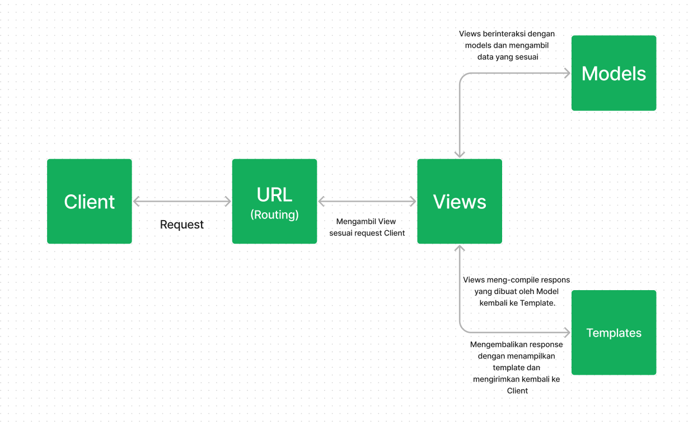
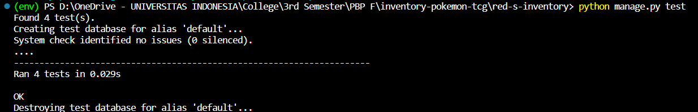

Nama    : Tegar Wahyu Khisbulloh
NPM     : 2206082032
Kelas   : PBP F

## Jelaskan bagaimana cara kamu mengimplementasikan checklist di atas secara step-by-step (bukan hanya sekadar mengikuti tutorial).

### Membuat Proyek Django baro
- Langkah pertama sebelum membuat Proyek Django adalah menginstall Django. Hal ini dapat dilakukan dengan atau tanpa virtual environment. Saya menginstall dengan virtual environment, caranya adalah sebagai berikut:
a. Membuat direktori proyek misal `red-s-inventory`
b. Buat virtual environment dengan command `python -m venv env`
c. Jalankan virtual environment dengan command `env\Scripts\activate.bat`

- Untuk keperluan app ini, saya menggunakan dependencies yang akan diinstall bersamaan dengan Django yang disimpan dalam file `requirements.txt` yang berisi :
   ```text
    django
    gunicorn
    whitenoise
    psycopg2-binary
    requests
    urllib3
    ```
- Kemudian saya menjalankan command `pip install -r requirements.txt` untuk menginstall django dengan beberapa dependencies

- Buat proyek baru dengan menjalankan command 
   ```bash
    django-admin startproject red-s-inventory'
   ```

- Saya menambahkan `*` di `settings.py` di bagian `ALLOWED_HOSTS` untuk keperluan deployment

### Membuat aplikasi dengan nama `main` pada proyek
- Untuk membuat sebuah app `main`, saya menjalankan command 
```bash
python manage.py startapp main
``` 

- Setelah app dibuat, saya mendaftarkan app `main`` ke dalam `settings.py`
```python
  INSTALLED_APPS = [
    ...,
    'main',
    ...
  ]
  ```

### Melakukan Routing pada Proyek agar dapat menjalankan `main`
Untuk melakukan Routing, saya perlu menambahkan pola url ke dalam `urlpatterns` yang ada di dalam file `urls.py` dalam
```python
  from django.contrib import admin
  from django.urls import path, include
  
  urlpatterns = [
      path('admin/', admin.site.urls),
      path('main/', include('main.urls')),  # menambahkan baris ini
  ]
  ```
Tujuan penambahan ini adalah untuk menetapkan rute dasar untuk app `main`

### Membuat Model Item
- Pada tahap ini, saya menyesuaikan `models.py` untuk keperluan app saya yaitu:
```python
    from django.db import models

    class Item(models.Model):
        name = models.CharField(max_length=255)
        amount = models.IntegerField()
        description = models.TextField()
  ```

- Setelah itu, saya melakukan membuat berkas migrasi dan mengaplikasikannya ke basis data dengan command:
```bash
  python manage.py makemigrations
  ```
dan 
``` bash
  python manage.py migrate
  ```

### Membuat fungsi pada views.py
Pada tahap ini, saya dapat menentukan seperti apa tampilan app saya nanti.
- Pertama tama, saya perlu membuat direktori `templates` dalam direktori `main` untuk menyimpan file html
- Kemudian, saya perlu membuat file `main.html` dan mengisinya sesuai ketentuan soal dan menambahkan beberapa hal sesuai preferensi saya

### Membuat routing pada `urls.py` pada `aplikasi main`
Tahap ini dilakukan pada file `urls.py` yang berada di direktori `main`
from django.urls import path
```python
from main.views import homepage

app_name = 'main'

urlpatterns = [
    path('', homepage, name='homepage'),
]
```

### Deployment 
- Dalam tahap ini saya perlu Sign In ke dalam website adaptable dan menghubungkan repository yang telah saya buat. Kemudian menyesuaikan beberapa hal yang diminta oleh Adaptable seperti `deployment branch, template deployment, tipe basis data, dan start command`.
- Kemudian saya melakukan deployment dengan menekan `Deploy App`

### Membuat README.md 
- Dalam pembuatan versi terbaru aplikasi saya ini, terdapat kendala deployment yaitu pemblokiran akun oleh Adaptable sehingga tidak bisa menambahkan link untuk menuju ke dalam aplikasi saya.


## Buatlah bagan yang berisi request client ke web aplikasi berbasis Django beserta responnya dan jelaskan pada bagan tersebut kaitan antara `urls.py`, `views.py`, `models.py`, dan berkas `html`.


- `urls.py` adalah tempat untuk mendefinisikan rute rute aplikasi pada proyek Django. Ada 2 `urls.py` :
1. `urls.py` pada proyek Django, berfungsi sebagai penghubung rute dasar dengan rute yang didefinisikan pada `urls.py` pada direktori app
2. `urls.py` pada direktori app, berfungsi menghubungkan rute tertentu setiap aplikasi dengan fungsi `views` yang sesuai.

- `views.py` berisi beberapa fungsi untuk mememnuhi permintaan Client dengan mengakses `models.py` dan menampilkan `template html` sesauai request

- `models.py` adalah struktur atau kerangkan data aplikasi. `models.py` digunakan oleh `views.py` untuk menyimpan, mengambil, atau memodifikasi data dalam database.

- `template html` berisi template tampilan yang akan digunakan sebagai response yang dikirimkan ke Client. Response akan berupa template yang sudah disesuaikan dengan data yang diperoleh pada request dan sesuai dengan kerangka data pada `models.py`

## Jelaskan mengapa kita menggunakan virtual environment? Apakah kita tetap dapat membuat aplikasi web berbasis Django tanpa menggunakan virtual environment?

Ada beberapa alasan mengapa kita menggunakan virtual environment:

1. Isolasi Proyek: Virtual environment memungkinkan kita untuk membuat lingkungan yang terisolasi untuk setiap proyek Python yang kita kerjakan. Ini berarti semua dependensi (library dan package Python) yang diperlukan untuk proyek tersebut dapat diinstal secara independen di lingkungan tersebut. Dengan cara ini, proyek-proyek yang berbeda tidak akan saling mengganggu atau memiliki konflik dalam hal dependensi.

2. Versi Python yang Berbeda: kita dapat menggunakan versi Python yang berbeda untuk setiap lingkungna virtual. Ini berguna jika kita bekerja pada proyek-proyek yang memerlukan versi Python yang berbeda.

3. Mudah Dikelola: Virtual environment memudahkan pengelolaan dependensi proyek kita. kita dapat membuat daftar dependensi yang diperlukan dalam file khusus seperti requirements.txt, yang dapat dengan mudah diinstal atau diperbarui dalam lingkungan virtual tertentu.

4. Menghindari Konflik: Tanpa virtual environment, jika kita menginstal package atau library global, ini dapat mengakibatkan konflik dengan paket lain yang memerlukannya. Ini dapat merusak stabilitas sistem kita.

5. Keamanan: Virtual environment membantu mencegah proyek kita mengubah atau merusak instalasi Python global yang mungkin diperlukan oleh sistem operasi atau aplikasi lain.

Ya, kita dapat membuat aplikasi web berbasis Django tanpa menggunakan virtual environment. Namun, tidak disarankan karena akan menyulitkan pengelolaan proyek kita dan dapat menyebabkan masalah dependensi. Menggunakan virtual environment adalah praktik terbaik dalam pengembangan Python, dan itu akan membuat pengelolaan proyek kita lebih mudah, lebih aman, dan lebih terorganisir.

## Jelaskan apakah itu MVC, MVT, MVVM dan perbedaan dari ketiganya.

1. MVC (Model-View-Controller):
Model: Merepresentasikan data dan logic dalam aplikasi.
View: Menangani tampilan dan presentasi data.
Controller: Mengendalikan alur aplikasi dan berfungsi sebagai perantara antara Model dan View.

2. MVT (Model-View-Template):
Model: Merepresenasikan data dan logic.
View: Menangani tampilan dan presentasi data.
Template: Menentukan cara data disajikan dalam HTML. Template menggantikan peran Controller dalam MVC.

3. MVVM (Model-View-ViewModel):
Model: Merepresentasikan data dan logic.
View: Menangani tampilan dan presentasi data.
ViewModel: Berfungsi sebagai perantara antara Model dan View. Ini mengelola data yang diperlukan oleh View dan berfungsi untuk memisahkan logika tampilan dari Model.

Perbedaannya:
- MVC adalah pola desain yang digunakan terutama dalam pengembangan software desktop dan web tradisional. Memiliki Controller yang mengendalikan alur aplikasi.
- MVT mirip dengan MVC, tetapi dalam konteks Django, Template (yang menggantikan Controller) digunakan untuk menentukan cara data disajikan dalam HTML.
- MVVM adalah pola desain yang digunakan dalam aplikasi berbasis interface pengguna yang lebih kompleks, terutama dalam pengembangan aplikasi seluler dan aplikasi dengan tampilan dinamis. Menggunakan ViewModel untuk mengelola data yang ditampilkan di View, memungkinkan tampilan untuk berubah otomatis sesuai dengan perubahan data pada Model, sehingga membuat aplikasi lebih reaktif dan mudah diuji.

## Bonus
- Saya menambahkan beberapa tes dalam `test.py` untuk Model dan response:
```python
    # test_pokeball_item: memastikan bahwa item pokeball ada
    def test_pokeball_item(self):
        pokeBall = Item.objects.create(name='Pokeball', amount=10, description='Pokeball is a ball')
        field_label = pokeBall._meta.get_field('name').verbose_name
        self.assertEqual(field_label, 'name')

    # test_medicine_item: memastikan bahwa item medicine ada
    def test_medicine_item(self):
        pokeBall = Item.objects.create(name='Potion', amount=10, description='Potion is a medicine')
        field_label = pokeBall._meta.get_field('name').verbose_name
        self.assertEqual(field_label, 'name')
```
- Untuk menjalankan tes tersebut bisa dilakukan dengan command `python manage.py test`
