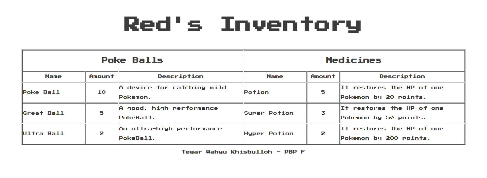
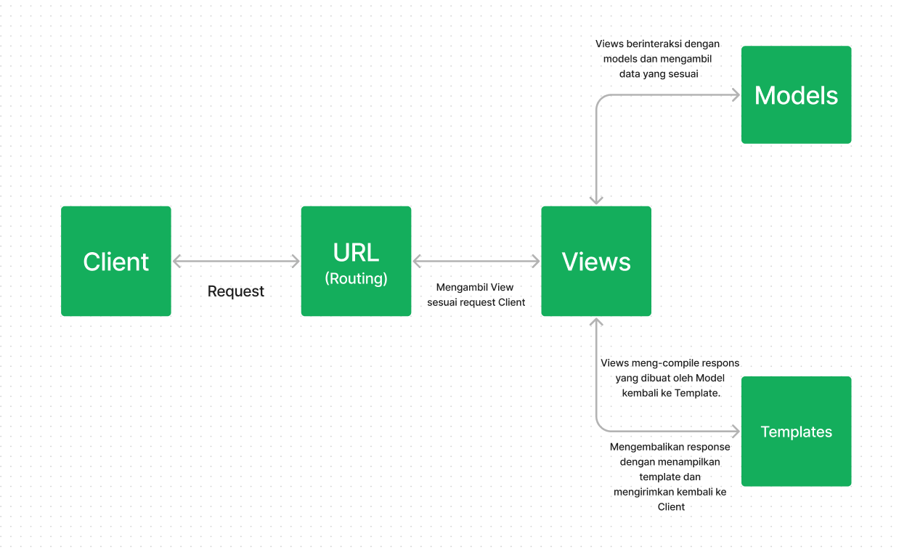
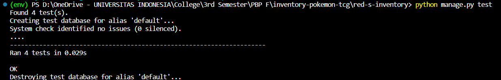
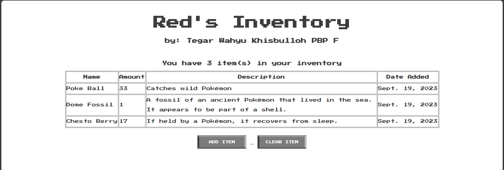
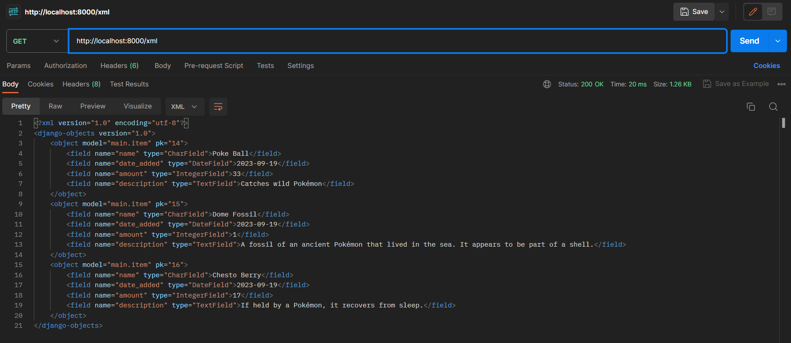
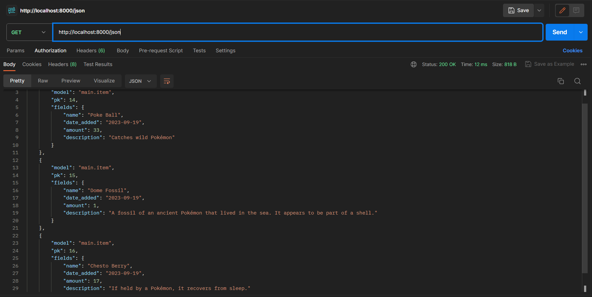
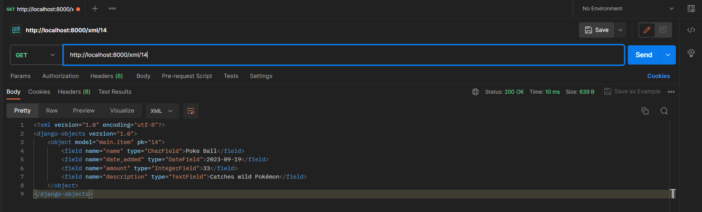
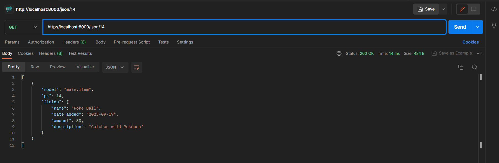

https://red-s-inventory.adaptable.app/

Nama    : Tegar Wahyu Khisbulloh <br>
NPM     : 2206082032 <br>
Kelas   : PBP F <br>

# TUGAS 2

## Jelaskan bagaimana cara kamu mengimplementasikan checklist di atas secara step-by-step (bukan hanya sekadar mengikuti tutorial).

### Membuat Proyek Django baro
- Langkah pertama sebelum membuat Proyek Django adalah menginstall Django. Hal ini dapat dilakukan dengan atau tanpa virtual environment. Saya menginstall dengan virtual environment, caranya adalah sebagai berikut:
a. Membuat direktori proyek misal `red-s-inventory`
b. Buat virtual environment dengan command `python -m venv env`
c. Jalankan virtual environment dengan command `env\Scripts\activate.bat`

- Untuk keperluan app ini, saya menggunakan dependencies yang akan diinstall bersamaan dengan Django yang disimpan dalam file `requirements.txt` yang berisi :
   ```text
    django
    gunicorn
    whitenoise
    psycopg2-binary
    requests
    urllib3
    ```
- Kemudian saya menjalankan command `pip install -r requirements.txt` untuk menginstall django dengan beberapa dependencies

- Buat proyek baru dengan menjalankan command 
   ```bash
    django-admin startproject red-s-inventory'
   ```

- Saya menambahkan `*` di `settings.py` di bagian `ALLOWED_HOSTS` untuk keperluan deployment

### Membuat aplikasi dengan nama `main` pada proyek
- Untuk membuat sebuah app `main`, saya menjalankan command 
```bash
python manage.py startapp main
``` 

- Setelah app dibuat, saya mendaftarkan app `main`` ke dalam `settings.py`
```python
  INSTALLED_APPS = [
    ...,
    'main',
    ...
  ]
  ```

### Melakukan Routing pada Proyek agar dapat menjalankan `main`
Untuk melakukan Routing, saya perlu menambahkan pola url ke dalam `urlpatterns` yang ada di dalam file `urls.py` dalam
```python
  from django.contrib import admin
  from django.urls import path, include
  
  urlpatterns = [
      path('admin/', admin.site.urls),
      path('main/', include('main.urls')),  # menambahkan baris ini
  ]
  ```
Tujuan penambahan ini adalah untuk menetapkan rute dasar untuk app `main`

### Membuat Model Item
- Pada tahap ini, saya menyesuaikan `models.py` untuk keperluan app saya yaitu:
```python
    from django.db import models

    class Item(models.Model):
        name = models.CharField(max_length=255)
        amount = models.IntegerField()
        description = models.TextField()
  ```

- Setelah itu, saya melakukan membuat berkas migrasi dan mengaplikasikannya ke basis data dengan command:
```bash
  python manage.py makemigrations
  ```
dan 
``` bash
  python manage.py migrate
  ```

### Membuat fungsi pada views.py
Pada tahap ini, saya dapat menentukan seperti apa tampilan app saya nanti.
- Pertama tama, saya perlu membuat direktori `templates` dalam direktori `main` untuk menyimpan file html
- Kemudian, saya perlu membuat file `main.html` dan mengisinya sesuai ketentuan soal dan menambahkan beberapa hal sesuai preferensi saya

### Membuat routing pada `urls.py` pada `aplikasi main`
Tahap ini dilakukan pada file `urls.py` yang berada di direktori `main`
from django.urls import path
```python
from main.views import homepage

app_name = 'main'

urlpatterns = [
    path('', homepage, name='homepage'),
]
```

### Deployment 
- Dalam tahap ini saya perlu Sign In ke dalam website adaptable dan menghubungkan repository yang telah saya buat. Kemudian menyesuaikan beberapa hal yang diminta oleh Adaptable seperti `deployment branch, template deployment, tipe basis data, dan start command`.
- Kemudian saya melakukan deployment dengan menekan `Deploy App`


### Membuat README.md 
- Dalam pembuatan versi terbaru aplikasi saya ini, terdapat kendala deployment yaitu pemblokiran akun oleh Adaptable sehingga tidak bisa menambahkan link untuk menuju ke dalam aplikasi saya.


## Buatlah bagan yang berisi request client ke web aplikasi berbasis Django beserta responnya dan jelaskan pada bagan tersebut kaitan antara `urls.py`, `views.py`, `models.py`, dan berkas `html`.


- `urls.py` adalah tempat untuk mendefinisikan rute rute aplikasi pada proyek Django. Ada 2 `urls.py` :
1. `urls.py` pada proyek Django, berfungsi sebagai penghubung rute dasar dengan rute yang didefinisikan pada `urls.py` pada direktori app
2. `urls.py` pada direktori app, berfungsi menghubungkan rute tertentu setiap aplikasi dengan fungsi `views` yang sesuai.

- `views.py` berisi beberapa fungsi untuk mememnuhi permintaan Client dengan mengakses `models.py` dan menampilkan `template html` sesauai request

- `models.py` adalah struktur atau kerangkan data aplikasi. `models.py` digunakan oleh `views.py` untuk menyimpan, mengambil, atau memodifikasi data dalam database.

- `template html` berisi template tampilan yang akan digunakan sebagai response yang dikirimkan ke Client. Response akan berupa template yang sudah disesuaikan dengan data yang diperoleh pada request dan sesuai dengan kerangka data pada `models.py`

## Jelaskan mengapa kita menggunakan virtual environment? Apakah kita tetap dapat membuat aplikasi web berbasis Django tanpa menggunakan virtual environment?

Ada beberapa alasan mengapa kita menggunakan virtual environment:

1. Isolasi Proyek: Virtual environment memungkinkan kita untuk membuat lingkungan yang terisolasi untuk setiap proyek Python yang kita kerjakan. Ini berarti semua dependensi (library dan package Python) yang diperlukan untuk proyek tersebut dapat diinstal secara independen di lingkungan tersebut. Dengan cara ini, proyek-proyek yang berbeda tidak akan saling mengganggu atau memiliki konflik dalam hal dependensi.

2. Versi Python yang Berbeda: kita dapat menggunakan versi Python yang berbeda untuk setiap lingkungna virtual. Ini berguna jika kita bekerja pada proyek-proyek yang memerlukan versi Python yang berbeda.

3. Mudah Dikelola: Virtual environment memudahkan pengelolaan dependensi proyek kita. kita dapat membuat daftar dependensi yang diperlukan dalam file khusus seperti requirements.txt, yang dapat dengan mudah diinstal atau diperbarui dalam lingkungan virtual tertentu.

4. Menghindari Konflik: Tanpa virtual environment, jika kita menginstal package atau library global, ini dapat mengakibatkan konflik dengan paket lain yang memerlukannya. Ini dapat merusak stabilitas sistem kita.

5. Keamanan: Virtual environment membantu mencegah proyek kita mengubah atau merusak instalasi Python global yang mungkin diperlukan oleh sistem operasi atau aplikasi lain.

Ya, kita dapat membuat aplikasi web berbasis Django tanpa menggunakan virtual environment. Namun, tidak disarankan karena akan menyulitkan pengelolaan proyek kita dan dapat menyebabkan masalah dependensi. Menggunakan virtual environment adalah praktik terbaik dalam pengembangan Python, dan itu akan membuat pengelolaan proyek kita lebih mudah, lebih aman, dan lebih terorganisir.

## Jelaskan apakah itu MVC, MVT, MVVM dan perbedaan dari ketiganya.

1. MVC (Model-View-Controller):
Model: Merepresentasikan data dan logic dalam aplikasi.
View: Menangani tampilan dan presentasi data.
Controller: Mengendalikan alur aplikasi dan berfungsi sebagai perantara antara Model dan View.

2. MVT (Model-View-Template):
Model: Merepresenasikan data dan logic.
View: Menangani tampilan dan presentasi data.
Template: Menentukan cara data disajikan dalam HTML. Template menggantikan peran Controller dalam MVC.

3. MVVM (Model-View-ViewModel):
Model: Merepresentasikan data dan logic.
View: Menangani tampilan dan presentasi data.
ViewModel: Berfungsi sebagai perantara antara Model dan View. Ini mengelola data yang diperlukan oleh View dan berfungsi untuk memisahkan logika tampilan dari Model.

Perbedaannya:
- MVC adalah pola desain yang digunakan terutama dalam pengembangan software desktop dan web tradisional. Memiliki Controller yang mengendalikan alur aplikasi.
- MVT mirip dengan MVC, tetapi dalam konteks Django, Template (yang menggantikan Controller) digunakan untuk menentukan cara data disajikan dalam HTML.
- MVVM adalah pola desain yang digunakan dalam aplikasi berbasis interface pengguna yang lebih kompleks, terutama dalam pengembangan aplikasi seluler dan aplikasi dengan tampilan dinamis. Menggunakan ViewModel untuk mengelola data yang ditampilkan di View, memungkinkan tampilan untuk berubah otomatis sesuai dengan perubahan data pada Model, sehingga membuat aplikasi lebih reaktif dan mudah diuji.

## Bonus
- Saya menambahkan beberapa tes dalam `test.py` untuk Model dan response:
```python
    # test_pokeball_item: memastikan bahwa item pokeball ada
    def test_pokeball_item(self):
        pokeBall = Item.objects.create(name='Pokeball', amount=10, description='Pokeball is a ball')
        field_label = pokeBall._meta.get_field('name').verbose_name
        self.assertEqual(field_label, 'name')

    # test_medicine_item: memastikan bahwa item medicine ada
    def test_medicine_item(self):
        pokeBall = Item.objects.create(name='Potion', amount=10, description='Potion is a medicine')
        field_label = pokeBall._meta.get_field('name').verbose_name
        self.assertEqual(field_label, 'name')
```
- Untuk menjalankan tes tersebut bisa dilakukan dengan command `python manage.py test`


-----
# TUGAS 3

##  1. Apa perbedaan antara form `POST` dan form `GET` dalam Django?
<table>
  <tr>
    <th>POST</th>
    <th>GET</th>
  </tr>
  <tr>
    <td>Data/value tidak terlihat di URL</td>
    <td>Data/value terlihat di URL</td>
  </tr>
  <tr>
    <td>Paramater tidak tersimpan di web browser history</td>
    <td>Paramater tersimpan di web browser history</td>
  </tr>
  <tr>
  <td>Digunakan untuk meng-handle request yang bisa digunakan untuk mengubah keadaan sistem</td>
  <td>Digunakan untuk meng-handle request yang tidak mengubah keadaan sistem</td>
  </tr>
</table>

## 2. Apa perbedaan utama antara `XML`, `JSON`, dan `HTML` dalam konteks pengiriman data?
<table style="width:100%">
  <tr>
    <th>XML</th>
    <td>
    - Digunakan secara luas dalam berbagai aplikasi, termasuk pertukaran data antar sistem, konfigurasi, dan penyimpanan data yang sangat struktural.
    <br>
    - Lebih kompleks daripada JSON dan HTML karena memungkinkan definisi aturan dan struktur yang lebih kustom.</td>
  </tr>
  <tr>
    <th>JSON</th>
    <td>
    - Mendukung struktur data yang lebih sederhana daripada XML dan biasanya digunakan untuk pertukaran data di aplikasi web dan layanan web (API).
    <br>
    - Format penukaran data ringan yang mudah dibaca oleh manusia dan mudah diurai mesin.
    </td>
  </tr>
  <tr>
    <th>HTML</th>
    <td>
    - Tidak dirancang untuk pertukaran data seperti XML dan JSON.
    <br>
    - Digunakan untuk mengatur tampilan dan struktur halaman web, termasuk teks, gambar, tautan, formulir, dan elemen-elemen lainnya.
    </td>
  </tr>
</table>

## 3. Mengapa `JSON` sering digunakan dalam pertukaran data antara aplikasi web modern?
Karena JSON memiliki beberapa keunggulan yang membuatnya cocok untuk digunakan dalam pertukaran data antar aplikasi web. 
<br> 
Keunggulan tersebut antara lain:
1. JSON memiliki syntax yang sederhana dan mudah dibaca. 
2. JSON adalah format data yang ringan dan memiliki overhead yang minim. Ini berarti data JSON dapat dikirim dan diterima dengan cepat melalui jaringan, mengurangi latensi.
3. JSON sering digunakan dalam API berbasis REST (Representational State Transfer) yang banyak digunakan dalam pengembangan web modern. API REST menggunakan JSON untuk mengirim dan menerima data, memungkinkan aplikasi berkomunikasi dengan mudah.

## 4. Jelaskan bagaimana cara kamu mengimplementasikan checklist di atas secara step-by-step (bukan hanya sekadar mengikuti tutorial).

###  Membuat input `form` untuk menambahkan objek model pada app sebelumnya.
1. Membuat file `forms.py` dan menambahkan kode sebagai berikut:
```python
from django.forms import ModelForm
from main.models import Item

class ItemForm(ModelForm):
    class Meta:
        model = Item
        fields = ["name", "amount", "description"]
```
2. Menambahkan import yang dibutuhkan ke dalam `views.py`
```python
from django.http import HttpResponseRedirect # import untuk redirect ke halaman lain
from main.forms import ItemForm # Import ItemForm yang ada di dalam `forms.py`
from django.urls import reverse # # Import untuk kembali ke halaman utama
```

3. Menambahkan method baru dalam `views.py` untuk menghandle request menambahkan item
```python
def add_item(request):
    form = ItemForm(request.POST or None)
    
    if form.is_valid() and request.method == "POST":
        form.save()
        return HttpResponseRedirect(reverse('main:homepage'))

    context = {'form': form}
    return render(request, "add_item.html", context)
```

4. Meng-update method homepage dalam `views.py` untuk 
```python
def homepage(request):
    items = Item.objects.all() # Query semua item dari database
    context = {
        'name' : 'Tegar Wahyu Khisbulloh',
        'class' : 'PBP F',
        'items': items 
        }
    return render(request, "main.html", context)
```

5. Import method `add_item` tadi ke `urls.py`
```python
from main.views import homepage, add_item
```
Tambahkan path url `add_item` ke `urlpatterns`
```python
urlpatterns = [
..
path('add_item', add_item, name='add_item'),
...
]
```
6. Membuat file HTML `add_item.html` dalam direktori `main/templates` untuk menampilkan interface add_item
```HTML
 


<title>Add Item</title>
<head>
    <div class = "title">
        <h1>Add Item</h1>
    </div>

<form method="POST">
    
    <div class="form-container">
        <div class="input">
            {{ form.as_table }}
        </div>
        <button class="button">
            Add Item
        </button>
    </div>
</form>

</head>
<style>
    .input {
        margin: auto;
        box-sizing: border-box;
    }
    
    .input label {
        padding: 12px 12px 12px 0;
        display: inline-block;
    }
    
    .input input[type=text], input[type=number], textarea {
        width: 100%;
        padding: 12px;
        border: 1px solid #ccc;
        box-sizing: border-box;
        margin-top: 6px;
        margin-bottom: 16px;
        resize: vertical;
        background-color: #9f9f9f;
    }
    
    .form-container {
        max-width: 300px;
        width: 100%;
        padding: 20px;
        background-color: white;
        margin: auto;
        border: 10px solid #3d3c3c;
    }
</style>

```

7. Menyesuaikan tampilan `main.html`
```HTML
<body>
    <!-- Jika tidak ada item, sembunyikan tabel -->
    
    <table align="center" border="1px" style="width:1400px; line-height:30px;">
        <tr>
            <th>Name</th>
            <th>Amount</th>
            <th>Description</th>
            <th>Date Added</th>
        </tr>

         Berikut cara memperlihatkan data produk di bawah baris ini 

        
        <tr>
            <td>{{ item.name }}</td>
            <td>{{ item.amount }}</td>
            <td>{{ item.description }}</td>
            <td>{{ item.date_added }}</td>
        </tr>
        
    </table>
    
    <br />

    <div align="center">
        <a href="">
            <button class="button">
                Add Item
            </button>
        </a>

        <!-- Jika tidak ada item, sembunyikan button clear items -->
        
        <a href="">
            <button class="button">
                Clear Item
            </button>
        </a>
        

    </div>
</body>
```

###  Tambahkan 5 fungsi `views` untuk melihat objek yang sudah ditambahkan dalam format HTML, XML, JSON, XML *by ID*, dan JSON *by ID*.
1. Menambahkan beberapa import yang dibutuhkan terlebih dahulu
```python
from django.http import HttpResponse # import HttpResponse untuk menampilkan response
from django.core import serializers # import serializers untuk mengubah data menjadi json atau xml
```
2. Menambahkan fungsi `show_xml`, `show_json`, `show_xml_by_id`, `show_json_by_id`. (Fungsi untuk menampilkan data dalam format html sudah dibuat yaitu fungsi `homepage`)
```python
def show_xml(request):
    # Mengambil semua data dari database
    data = Item.objects.all() 
    # Mengembalikan response berupa XML
    return HttpResponse(serializers.serialize("xml", data), content_type="application/xml") 
def show_json(request):
    # Mengambil semua data dari database
    data = Item.objects.all()
    # Mengembalikan response berupa JSON
    return HttpResponse(serializers.serialize("json", data), content_type="application/json")

def show_xml_by_id(request, id):
    # Mengambil semua data dari database berdasarkan ID
    data = Item.objects.filter(pk=id)
    # Mengembalikan response berupa XML
    return HttpResponse(serializers.serialize("xml", data), content_type="application/xml")

def show_json_by_id(request, id):
  # Mengambil semua data dari database berdasarkan ID
    data = Item.objects.filter(pk=id)
    # Mengembalikan response berupa JSON
    return HttpResponse(serializers.serialize("json", data), content_type="application/json")
```
###  Membuat routing URL untuk masing-masing `views` yang telah ditambahkan pada poin 2.

1. Import 5 fungsi yang telah dibuat ke `urls.py` 
```python
from main.views import homepage, add_item, clear_items, show_xml, show_json, show_xml_by_id, show_json_by_id 
```
2. Menambahkan pattern url untuk masing-masing fungsi dalam variabel `urlpatterns`
```python
urlpatterns = [
    ...
    path('', homepage, name='homepage'), # HTML
    path('xml/', show_xml, name='show_xml'), # XML
    path('json/', show_json, name='show_json'), # JSON
    path('xml/<int:id>/', show_xml_by_id, name='show_xml_by_id'), # XML by ID
    path('json/<int:id>/', show_json_by_id, name='show_json_by_id'), # JSON by ID
    ...
]
```

## Mengakses kelima URL di poin 2 menggunakan Postman, membuat screenshot dari hasil akses URL pada Postman, dan menambahkannya ke dalam `README.md`.
1. HTML

2. XML

3. JSON

4. XML by ID

5. JSON by ID


## BONUS: Menambahkan pesan "Kamu menyimpan X item pada aplikasi ini"
Menambahkan baris kode berikut ke dalam `main.html`
```HTML
<h3 align="center">You have {{ items|length }} item(s) in your inventory</h3>
```
